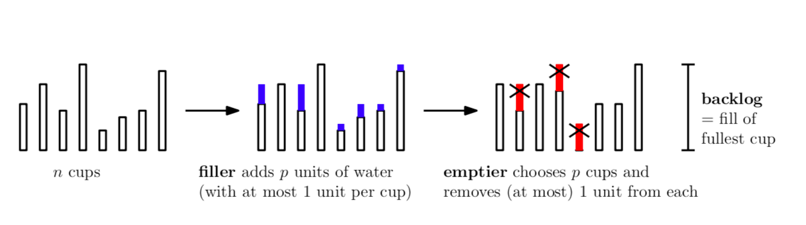

# The Cup Games

The cup game is a classic problem in computer science that models work
scheduling.  In the cup game on n cups, a filler and an emptier take turns
adding and removing water from cups (i.e. new tasks come in and the scheduler
must allocate processors to handle the incoming work). On each round the filler
will distribute some new amount of water among the cups, and the emptier will
remove some amount of water from some of the cups. The filler can distribute
the water however it wants (as long as it places at most a single unit of water
in each cup), but the emptier has an added "discretization constraint": it can
only remove water from some fixed number of cups (it removes a unit of water
from each cup). The problem is to analyze how well each player can do, that is,
how much water can the filler force to be in the fullest cup, and what is the
upper bound on this fill that an appropriate emptying strategy can guarantee?
We study several variants of the problem and answer some open questions.

# results

- (main results) Variable-Processor cup game

We ask the natural question: "what if the number of processors is
allowed to change?"
Allowing the filler to change the resources drastically alters
the game.

* An adaptive filler can achieve backlog linear in the number of
cups! Classically there is a logarithmic upper bound! Wow!
  * An adaptive filler can achieve backlog $\Omega(n^{1-\epsilon})$ for constant
  $\epsilon$ in running time $2^{\log^2 n}$
  * An adaptive filler can achieve backlog $\Omega(n)$ in running time $O(n!)$
* A greedy emptier never lets backlog exceed $O(n)$
* An oblivious filler can still get polynomial backlog! But only
against "greedy-like" emptiers. 
  * In particular, we show that an oblivious filler can achieve
  backlog $\Omega(n^{1-\epsilon})$ against an $O(1)$-greedy-like
  emptier with probability at least $1-2^{-\polylog(n)}$ in
  running time $2^{\polylog(n)}$.

- (minor result) Multi-Processor Cup Game: Adaptive lower bound

We provide a simple construction that an adaptive filler can use
to get large backlog. Combined with previous work by Kuszmaul
this implies that backlog $\Theta(\log n)$ is tight for the
adaptive case of the multi-processor cup game, regardless of the
number of processors.

